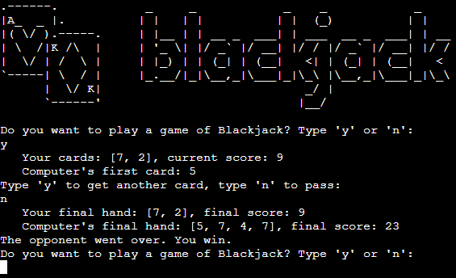
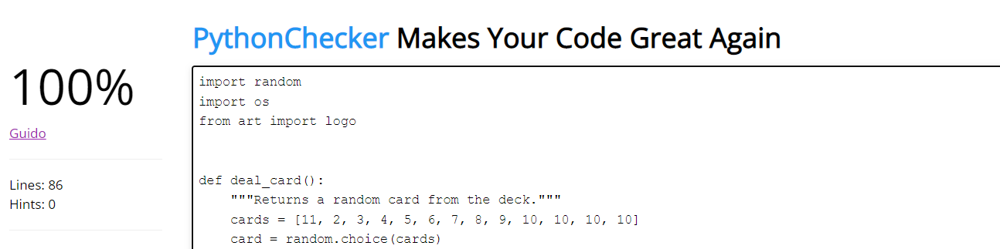

# Blackjack  

A simple terminal version of the classic card game Blackjack in python language.

According to the website [AskPython](https://www.askpython.com/python/examples/blackjack-game-using-python) the basic rules of Blackjack are:

- A card is dealt to the player facing upwards (visible to everyone).
- The dealer deals a card to himself visible to everyone.
- Another card is given to the player facing upwards.
- The dealer deals a card facing downwards for himself.
- The player has to decide whether to stand with the current set of cards or get another card.
- If the player decides to hit, another card is dealt.
- If the player decides to stand, then the dealer reveals his hidden card.
- The dealer does not have the authority to decide whether to hit or stand. The general rule is that the dealer needs to keep hitting more cards if the sum of the dealer’s cards is less than 17.
- As soon as the sum of the dealer’s cards is either 17 or more, the dealer is obliged to stand.
- According to the final sum of the cards, the winner is decided.

The live link for the site can be found here - https://blackjack-terminal.herokuapp.com/

# Table of contents
- [Design and Planning](#design-and-planning)
  - [Game Process Planning Flow Chart](#game-process-planning-flow-chart)
- [Languages Used](#languages-used)
- [Features](#features)
  - [Existing Features](#existing-features)
    - [Logo and Subtitle](#logo-and-subtitle)
    - [How to Play](#how-to-play)
- [Data Model](#data-model)
  - [Lists and Random module](#classes-and-object-oriented-programming)
- [Testing](#testing)
  - [Test of User Story](#test-of-user-story-game-functionality)
  - [Test on Alternative Browsers](#test-on-alternative-browsers)
  - [Debugging](#debugging)
  - [Validator Testing](#validator-testing)
  - [Unfixed Bugs](#unfixed-bugs)
  - [Libraries and Programs Used](#libraries-and-programs-used)
- [Deployment](#deployment)
- [Credits](#credits)
  - [Content](#content)

# Design and Planning

**Game Process Planning and Flow Chart**

The game was designed after a list of the game requirements was created and organised as shown below:

1 - Deal the user and computer a starting hand of 2 random cards.

2 - Detect when and if the computer or user has a blackjack. (Ace(1 or 11) + 10 value card).

3 - If the computer gets blackjack, then the user loses automatically. Only if the user gets a blackjack, then they win.

4 - Calculate the user's and computer's scores.

5 - If an ace is drawn, count it as 11. Only if the total goes over 21, count it as 1 instead.

6 - Reveal the computer's first card only.

7 - The game ends when the user's score is bigger than 21 or if the user or computer gets a blackjack.

8 - Ask the user if they want to get another card.

9 - Once the user is done, let the computer play. The computer should keep drawing cards unless their score goes over 16.

10 - Compare user and computer scores. It could be a win, loss, or draw.

11 - Print out the player's and computer's final hand and their scores when the game is finished.

12 - After the game ends, ask the user if they'd like to play again. Start the game with logo again.

The next step was to transform this numbered list into a flowchart:

# Languages Used

- Python

# Features

## Existing Features:

### Logo and Subtitle

A logo and subtitle are displayed at the beginning of the game to invite the user to start or leave the game:

### How to Play

The purpose of this project was to practice basic commands and features of the python language. Being that so everything was meant to be simple. No images are here printed for the cards and no chips or money are gambled. 
The user will see his hand and cards represented by numbers inside of a list in the terminal interface.

The user is instructed to type 'y' to get another card or 'n' to pass for the computer to continue.

At every step of the game, the user will be informed the user's cards will be shown and only the first card of the computer is displayed.

When the game is ended and either the computer or the user is the winner both hands are displayed.

- User Wins/user loses Messages

After every end game, the user will have a feedback message informing, them whether they won, lost or whether there has been a draw. The reason for the win/lose/draw is also informed in the same message.

*User Wins Message*

*User Loses Message*

*Draw Game Message*

The same message at the beginning will be displayed at the end of every game.

*End/Begin Game Message*

# Data Model

## Lists and Random Module

The centre of the game is represented by a list of numbers from 2 to 11, representing the cards in a deck, where the number 10 is present four times, serving as its original value 10 as well as the jack, queen and king.

A number is called randomly from the list every time the deal_card function is called, to be then appended to the lists user_cards and computer_cards that will represent the user's and computer's hands respectively. 

# Testing

## Test Game Functionality:

| Test   |      Expected     |  Passed |
|--------|:------------------|:--------:|
|Open Website|Game Title and start game message |☑|
|Select 'y' or 'n'|After 'y' is select the game proceeds. After 'n' is selected the game is ended.|☑|
|First round is dealt |Two cards of the user and the first card of the computer are displayed.|☑|
|Blackjack Message|If the computer or the user gets a Blackjack the winner is announced and the game is called again. |☑|
|Called for another round|If no blackjack appears another round is called.|☑|
|User loses Message|if the user loses the message is displayed accompanied by the reason.|☑|
|User wins Message|if the user wins the message is displayed accompanied by the reason.|☑|
|Draw message|If a draw happens the game is ended the draw is announced|☑|
|Call for another game|After the game has finished, the user is asked if they'd like to play once again.|☑|

## Test on Alternative Browsers

|   Test   |   Layout (Pass)   |   Functionality (Pass)   |
|----------|:-----------------:|:-------------------------:|
|Chrome    |      ☑           |            ☑             |
|Safari    |      ☑           |            ☑             |
|Firefox   |      ☑           |            ☑             |
|Edge      |      ☑           |            ☑             |

## Debugging

No bugs were encountered during the deployment or making of the game.

## Validator Testing

*PEP8 Online Checker: run.py file*

*PEP8 Online Checker: art.py file*

*Lighthouse (Accessibility Audit):*

## Libraries and Programs Used

- Github: Store Repository
- Gitpod: Create the python files
- Google Chrome, Microsoft Edge, Mozilla Firefox, Safari: Site testing on alternative browsers
- Microsoft Paint: Screenshots of the final project for the README file
- Draw.io: Used to draw the flowcharts

# Deployment

This project was deployed on Heroku using Code Institute's Python Essentials template. The steps taken to create the Heroku App were:

**Preparation for deployment on GitHub:**

1. Add a new line character ("\n") after each input request
2. Type into the terminal 'pip3 freeze > requirements.txt' to update this file with a list of dependencies that Heroku needs to download for the application to work

**Deployment on Heroku:**

1. Create an App
2. Add creds.json file information to the Apps Config Vars
3. Add the 'Python' and the 'Nodejs' buildpacks
4. Select the GitHub Deployment Method, and confirm the connection to GitHub
5. Search and connect to the Hangman Game GitHub Repository
6. Enable 'Automatic Deploys'
7. Then manually deploy by selecting the 'Deploy Branch' button
8. The app will then be successfully deployed: press the 'view' button to open the deployed site 

The live link for the site can be found here - https://blackjack-terminal.herokuapp.com/

## Content

Resources Used:

This Blackjack game was inspired by the following web pages: 
- https://www.blackjackapprenticeship.com/how-to-play-blackjack/
- https://samarakoon-gayan.medium.com/a-game-of-black-jack-on-python-as-a-fun-exercise-3cd54efb9d83
- https://www.askpython.com/python/examples/blackjack-game-using-python
- https://data-flair.training/blogs/python-blackjack-game/
- https://edge.twinspires.com/casino-news/10-blackjack-rules-of-thumb-with-reasons-for-each/

- Clearing the terminal: https://stackoverflow.com/questions/2084508/clear-terminal-in-python

- ASCII logo intro image
https://patorjk.com/software/taag/#p=display&f=Graffiti&t=Type%20Something%20

Code Institute's Love Sandwiches Walkthrough Project:

- Getting Set Up (Creating the Google Sheets API)
- Deployment (Deployment to Heroku)